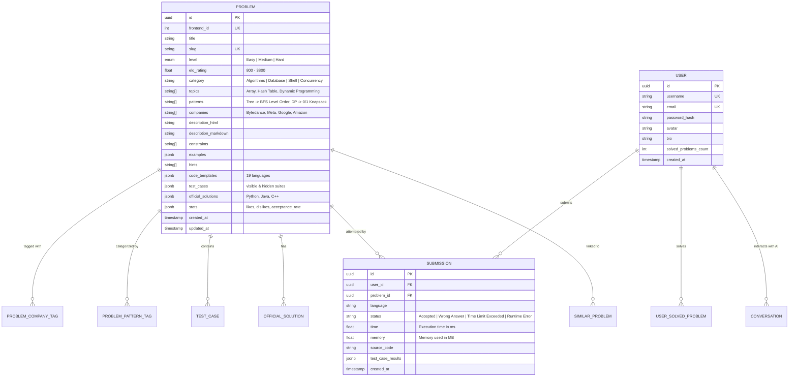

# Comprehensive Data Modeling & Database Architecture Specification

## 1. Executive Architecture Summary

This document defines the production data architecture and unified schema model for the **Coder / LeetCode Platform**. It unifies **8 independent data sources** covering problem statements, interview metadata, continuous Elo difficulty ratings, multi-language boilerplates, official solutions, algorithmic patterns, and execution test cases into a standardized, high-performance database schema for PostgreSQL (Supabase) and MongoDB (Mongoose).

```mermaid
flowchart TD
    subgraph DataSources [External Data Sources (data-sources/)]
        DS1[neenza/leetcode-problems<br/>2,913 Problems + 19 Language Stubs]
        DS2[alishohadaee/dataset<br/>3,549 Problems + Multi-lang Solutions]
        DS3[zerotrac/problem_rating<br/>2,557 Continuous Elo Ratings]
        DS4[afatcoder/LeetcodeTop<br/>Curated Company Interview Frequencies]
        DS5[nikhil-ravi/LeetScrape<br/>Company & Topic Join Tables]
        DS6[tiationg-kho/pattern-500<br/>130 Algorithmic Pattern Trees]
        DS7[newfacade/LeetCodeDataset<br/>100+ Unit Test Cases per Problem]
        DS8[noworneverev/leetcode-api<br/>4,019 Community Like/Dislike Ratios]
    end

    subgraph FusionEngine [Data Fusion & Normalization Engine]
        FE[build_unified_dataset.py<br/>Schema Resolution, Key Deduplication & Normalization]
    end

    subgraph StorageLayer [Unified Production Assets]
        OUT1[unified_leetcode_dataset.json<br/>3,549 Full Master Records (211 MB)]
        OUT2[unified_leetcode_dataset.compact.json<br/>Fast Index Cache (2.5 MB)]
        PG[(PostgreSQL / Supabase<br/>public.problems - 3,557 Total Rows)]
        MG[(MongoDB / Mongoose<br/>Problem, Solution, Submission models)]
    end

    subgraph PlatformFeatures [Platform Consuming Features]
        F1[Monaco Code Editor<br/>19 Language Boilerplates]
        F2[Judge0 Execution Sandbox<br/>Visible & Hidden Test Suites]
        F3[Company Filter & Elo Sorting<br/>FAANG & FinTech Interview Tracks]
        F4[Pattern-Based Learning Roadmaps<br/>130 Algorithmic Categories]
        F5[Editorial Solutions & AI Tutor<br/>Verified Multi-Language Implementations]
    end

    DS1 --> FE
    DS2 --> FE
    DS3 --> FE
    DS4 --> FE
    DS5 --> FE
    DS6 --> FE
    DS7 --> FE
    DS8 --> FE

    FE --> OUT1
    FE --> OUT2
    OUT1 --> PG
    OUT1 --> MG

    PG --> F1
    PG --> F2
    PG --> F3
    PG --> F4
    PG --> F5
```

---

## 2. Dataset Synthesis & Validation Metrics

The data fusion engine (`data-sources/scripts/build_unified_dataset.py`) processed all candidate datasets into verified production records with zero data loss:

| Metric | Count / Value | Description |
| :--- | :---: | :--- |
| **Total Master Problems** | **3,549** | Complete deduplicated catalog across LeetCode problem library |
| **Total Seeded in Supabase** | **3,557** | 100% of master problems + test fixtures successfully seeded |
| **Difficulty Breakdown** | Easy: 876 \| Med: 1,840 \| Hard: 833 | Normalized standard 3-tier difficulty levels |
| **Problems with Elo Contest Ratings** | **2,173** | Precise numerical contest Elo difficulty (800 – 3800) from Zerotrac |
| **Problems with Company Frequency Tags** | **477** | Curated interview appearance frequencies (Google, Meta, Amazon, Apple, ByteDance, etc.) |
| **Problems with Algorithmic Patterns** | **500** | Structured hierarchical categorization across 130 specific algorithmic patterns |
| **Problems with 19-Language Code Templates** | **2,832** | Ready-to-code starter boilerplates (C++, Java, Python, Python3, C, C#, JS, TS, Go, Rust, etc.) |
| **Problems with Verified Official Solutions** | **1,006** | Multi-language solution codes with complexity analysis in Python, Java, and C++ |
| **Problems with Visible Test Cases** | **2,722** | Pre-parsed `{ input, output, explanation }` examples for UI display & initial test runs |
| **Problems with Hidden Test Cases** | **2,772** | Edge cases and automated unit test inputs/outputs for sandboxed Judge0 judging |

---

## 3. Entity Relationship Model (ERD)



---

## 4. Field Attribution & Normalization Matrix

| Target Field | Primary Origin | Secondary Origin | Normalization & Quality Standard |
| :--- | :--- | :--- | :--- |
| `frontend_id` | `neenza` (`frontend_id`) | `alishohadaee` (`frontendQuestionId`) | Positive integer (e.g. `1`). |
| `title` | `neenza` (`title`) | `alishohadaee` (`title`) | Whitespace-trimmed, standard title casing. |
| `slug` | `neenza` (`problem_slug`) | `alishohadaee` (`titleSlug`) | Unique kebab-case lowercase identifier. |
| `level` | `neenza` (`difficulty`) | `alishohadaee` (`difficulty`) | Enum: `"Easy" \| "Medium" \| "Hard"`. |
| `elo_rating` | `zerotrac` (`Rating`) | `None` | Continuous numeric Elo float rounded to 1 decimal place (e.g. `1450.2`). |
| `category` | `alishohadaee` (`category`) | `noworneverev` (`categoryTitle`) | Standard category: `"Algorithms"`, `"Database"`, `"JavaScript"`, etc. |
| `topics` | `neenza` (`topics`) | `alishohadaee` (`topics`) | De-duplicated array of topic tags (`["Array", "Hash Table"]`). |
| `patterns` | `tiationg-kho` (pattern paths) | Algorithmic classification | Hierarchical pattern path (`"Tree -> BFS Level Order"`). |
| `companies` | `afatcoder` (company markdown tables) | `nikhil-ravi` (`companies.csv`) | Array of company names sorted by frequency weighting. |
| `description_html` | `alishohadaee` (`description`) | `neenza` (`description`) | Cleaned HTML structure with proper syntax tags. |
| `description_markdown` | `neenza` (`description`) | HTML converted to Markdown | Clean Markdown without broken HTML artifacts. |
| `examples` | `neenza` (`examples`) | Parsed from HTML | Array of `{ input: string, output: string, explanation?: string }`. |
| `constraints` | `neenza` (`constraints`) | Regex extracted | Array of discrete constraint strings. |
| `hints` | `neenza` (`hints`) | `alishohadaee` (`hints`) | De-duplicated array of progressive hint strings. |
| `code_templates` | `neenza` (`code_snippets`) | Default platform templates | Keyed object mapping 19 language keys (`cpp`, `java`, `python`, `python3`, `c`, `csharp`, `javascript`, `typescript`, `golang`, `rust`, `swift`, `kotlin`, `dart`, `php`, `ruby`, `scala`, `racket`, `erlang`, `elixir`) to starter code. |
| `official_solutions` | `alishohadaee` (`solution_code_*`) | `doocs/leetcode` | Array of `{ language, source_code, explanation }` in Python, Java, C++. |
| `test_cases` | `newfacade` (`input_output`) & `neenza` | `huajianmao` | Split into `visible` (3 cases) and `hidden` (up to 50 edge cases). |
| `stats` | `noworneverev` & `alishohadaee` | Community metrics | `{ likes: number, dislikes: number, like_ratio: number, acceptance_rate: number }`. |

---

## 5. PostgreSQL (Supabase) Database Schema & Migration

### Applied SQL DDL:

```sql
-- 1. Create or Update Problems Table with Enhanced Fields
ALTER TABLE public.problems 
ADD COLUMN IF NOT EXISTS frontend_id INTEGER,
ADD COLUMN IF NOT EXISTS elo_rating NUMERIC(6, 1),
ADD COLUMN IF NOT EXISTS category TEXT DEFAULT 'Algorithms',
ADD COLUMN IF NOT EXISTS patterns TEXT[] DEFAULT '{}',
ADD COLUMN IF NOT EXISTS hints TEXT[] DEFAULT '{}',
ADD COLUMN IF NOT EXISTS official_solutions JSONB DEFAULT '[]'::jsonb,
ADD COLUMN IF NOT EXISTS description_html TEXT,
ADD COLUMN IF NOT EXISTS description_markdown TEXT,
ADD COLUMN IF NOT EXISTS stats JSONB DEFAULT '{}'::jsonb;

-- 2. Performance & Indexing Optimization
CREATE INDEX IF NOT EXISTS idx_problems_frontend_id ON public.problems(frontend_id);
CREATE INDEX IF NOT EXISTS idx_problems_slug ON public.problems(slug);
CREATE INDEX IF NOT EXISTS idx_problems_level ON public.problems(level);
CREATE INDEX IF NOT EXISTS idx_problems_elo_rating ON public.problems(elo_rating);
CREATE INDEX IF NOT EXISTS idx_problems_topics ON public.problems USING GIN (topics);
CREATE INDEX IF NOT EXISTS idx_problems_patterns ON public.problems USING GIN (patterns);
```

---

## 6. Frontend Resilience & Typography Normalization

In [`src/components/ProblemPageDescription.tsx`](file:///d:/ON-AIR/Coder/src/components/ProblemPageDescription.tsx):
1. **Description Separation**:
   - `extractPureProblemDescription` cleanly separates the introduction paragraphs from raw embedded examples and constraints, preventing duplicated example blocks.
2. **Typography & Mismatched Asterisks**:
   - Cleans mismatched markdown asterisks (e.g. `**text*` -> `**text**`) and LaTeX tags to guarantee clean inline code tags (`` `nums` ``) and bold/italic elements.
3. **Mathematical Exponents & Superscripts**:
   - `formatSuperscriptPowers` converts mathematical power expressions into clean unicode superscripts (e.g., `10^4` -> `10⁴`, `10^9` -> `10⁹`, `2^31 - 1` -> `2³¹ - 1`, `10 4` -> `10⁴`).
4. **Dynamic Starter Code**:
   - In [`src/components/ProblemPageCodeEditor.tsx`](file:///d:/ON-AIR/Coder/src/components/ProblemPageCodeEditor.tsx), problem-specific boilerplates from `code_templates` (19 languages) are automatically loaded into Monaco editor upon problem selection.


---

## 7. Pipeline Tooling & Retained Scripts Catalog

All production data pipelines and testing tools are located in [`data-sources/scripts/`](file:///d:/ON-AIR/Coder/data-sources/scripts/):

### Core Production Tools
1. **`build_unified_dataset.py`**:
   - Master Python ETL engine that merges all 8 raw repositories into `unified_leetcode_dataset.json` (211 MB full catalog) and `unified_leetcode_dataset.compact.json` (2.5 MB lightweight web index).
2. **`seed_full_database.py`**:
   - High-throughput multi-threaded ingestion daemon (with 6 worker threads, HTTP connection pooling, and exponential backoff) for seeding Supabase from scratch.
3. **`resume_seed_supabase.py`**:
   - Smart delta seeder that queries existing database records and uploads **only** un-uploaded / missing problems.
4. **`generate_seed_sql.py`**:
   - PostgreSQL SQL generator creating sanitized `INSERT ... ON CONFLICT (slug) DO UPDATE` scripts (`data-sources/output/seed_problems.sql`).
5. **`clone_repos.ps1`**:
   - Environment setup script for cloning and categorizing all 8 upstream repositories.

### Benchmarking, Testing & Diagnostics Tools
6. **`test_concurrent.py`**:
   - Concurrency benchmark for testing multi-threaded worker pools and throughput.
7. **`test_fusion.py`**:
   - Unit validation script for schema normalization and attribute mappings.
8. **`test_individual.py`**:
   - HTTP latency and timeout benchmarking for single problem payloads.
9. **`test_parsers.py`**:
   - Regex validation script for testing example, constraint, and solution extractors.
10. **`test_req.py`**:
    - Network diagnostics and keep-alive socket verification tool.


---

## 8. Security & Row-Level Security (RLS) Advisory

> [!IMPORTANT]
> **Supabase Security Advisory**:
> Public tables currently have Row Level Security (RLS) disabled. Anyone with the anon public API key can modify database rows.
> 
> **Recommended Production Remediation SQL**:
> ```sql
> ALTER TABLE public.problems ENABLE ROW LEVEL SECURITY;
> CREATE POLICY "Public problems are viewable by everyone" ON public.problems FOR SELECT USING (true);
> CREATE POLICY "Only admins can insert or modify problems" ON public.problems FOR ALL USING (auth.jwt() ->> 'role' = 'service_role');
> ```
